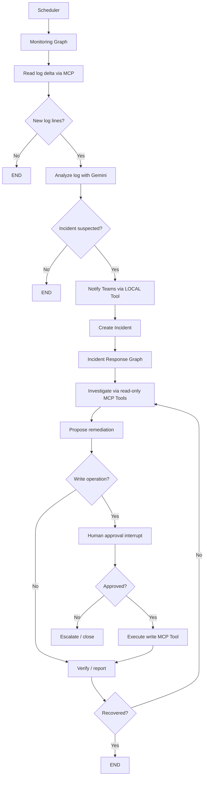

# JBoss Incident Response Agent 仕様書

## 1. 目的

本システムは、LangGraph の主要概念を実装を通じて学習するためのデモ・教材である。

本番運用を目的とした自律復旧システムではない。

### 学習対象

- State
- Node
- Edge
- Conditional Edge
- LLM Routing
- Structured Output
- Tool Calling
- `ToolNode`
- `tools_condition`
- MCP
- Human-in-the-loop
- Persistence / Checkpoint
- `thread_id`
- Loop
- Scheduler と Graph の責務分離
- Streamlit UI

---

## 2. システム概要

JBoss EAP 相当のサーバを定期監視し、ログ増分から障害兆候を検知する。

障害の疑いがある場合、Agent は JBoss の状態を MCP Tool 経由で追加調査し、原因推定と対処案を生成する。

設定変更等の write 操作は Human-in-the-loop で承認された場合のみ実行する。

### 基本フロー



---

## 3. 監視方式

### 3.1 定期実行

デフォルトは 180 秒ごと。

```env
POLL_INTERVAL_SECONDS=180
```

デモ時は 10 秒等に変更可能とする。

### 3.2 Scheduler の責務

Scheduler は LangGraph の外に置く。

Scheduler の仕事は Monitoring Graph を一定間隔で `invoke` することだけ。

LangGraph 内で長時間 `sleep` しない。

### 3.3 ログ差分

毎回 `server.log` 全体を LLM に渡さない。

前回読了位置を cursor として保持し、次回は増分のみ取得する。

例:

```text
previous_cursor = 1842093
new_cursor      = 1845632
```

MCP Tool:

```text
read_server_log(server_id, cursor)
```

返却例:

```json
{
  "server_id": "jboss-01",
  "from_cursor": 1842093,
  "to_cursor": 1845632,
  "lines": [
    "2026-09-05 17:24:01 WARN ...",
    "2026-09-05 17:24:02 ERROR ..."
  ]
}
```

---

## 4. Monitoring Graph

### 4.1 State

例:

```python
class MonitoringState(TypedDict):
    server_id: str
    previous_log_cursor: int
    current_log_cursor: int
    new_log_lines: list[str]
    incident_detected: bool
    severity: str | None
    category: str | None
    confidence: float | None
    summary: str | None
    evidence: list[str]
    incident_id: str | None
    teams_notified: bool
```

### 4.2 Nodes

#### collect_logs

- MCP の `read_server_log` を呼ぶ
- 前回 cursor 以降の増分だけ取得
- LLM は使わない

理由:

ログ取得は判断ではなく決定論的処理であるため。

#### analyze_logs

Gemini にログ増分を解析させる。

Structured Output の想定:

```json
{
  "incident_detected": true,
  "severity": "HIGH",
  "category": "THREAD_POOL",
  "confidence": 0.78,
  "summary": "HTTP worker thread exhaustion is suspected.",
  "evidence": [
    "rejected task warning",
    "request queue growth"
  ],
  "need_further_investigation": true
}
```

category 候補:

- `THREAD_POOL`
- `DATASOURCE_POOL`
- `DEPLOYMENT`
- `UNKNOWN`
- `NORMAL`

### 4.3 Conditional Edge

```text
new logs = false
    -> END

new logs = true
    -> analyze_logs

incident_detected = false
    -> END

incident_detected = true
    -> Teams notification
    -> create incident
```

---

## 5. Teams 通知

### 5.1 目的

LangGraph / LangChain のローカル Tool 実装を学習する。

JBoss Tool と異なり MCP にしない。

### 5.2 実装方式

```python
from langchain.tools import tool

@tool
def send_teams_alert(...):
    ...
```

LangGraph 側で:

```python
ToolNode([send_teams_alert])
```

を利用する。

可能であれば `tools_condition` を使用し、LLM の tool call -> ToolNode -> LLM の基本ループを一度体験できる構造にする。

### 5.3 Webhook

Teams Workflows の Webhook URL を利用する。

`.env`:

```env
TEAMS_WEBHOOK_URL=https://...
```

HTTP POST の実装は `httpx` を利用する。

### 5.4 通知内容

例:

```text
[JBoss Incident Detected]
Server: jboss-01
Severity: HIGH
Category: THREAD_POOL
Confidence: 78%
Summary: HTTP worker thread exhaustion is suspected.
Incident ID: inc-xxxxxxxx
```

### 5.5 二重送信防止

State に `teams_notified` を持ち、同一 Incident で複数回送らない。

Tool が `Command(update=...)` で State を更新する実装も学習候補とする。

---

## 6. Incident Response Graph

### 6.1 State

例:

```python
class IncidentState(TypedDict):
    incident_id: str
    server_id: str
    category: str
    severity: str
    confidence: float
    initial_log_lines: list[str]
    evidence: list[dict]
    messages: list
    investigation_count: int
    diagnosis: dict | None
    proposed_action: dict | None
    risk_level: str | None
    approval_status: str | None
    execution_result: dict | None
    recovered: bool | None
```

### 6.2 Investigation Agent

LLM に read-only MCP Tool のみ公開する。

例:

- `get_server_health`
- `get_thread_pool_status`
- `get_datasource_status`
- `get_deployment_status`
- `get_recent_config_changes`
- `read_server_log`

LLM は必要な Tool を自分で選ぶ。

### 6.3 Write Tool は分離

調査時点では write MCP Tool を LLM に公開しない。

理由:

- 誤実行防止
- 権限境界を明確にする
- Human-in-the-loop の意味を明確にする

### 6.4 原因推定

Agent は取得した evidence から診断を生成する。

例:

```json
{
  "root_cause": "THREAD_POOL_CONFIGURATION",
  "confidence": 0.96,
  "reason": "max_threads is saturated and was recently changed from 80 to 20",
  "recommended_action": {
    "type": "SET_THREAD_POOL_MAX_THREADS",
    "current_value": 20,
    "proposed_value": 80
  }
}
```

---

## 7. Risk Policy

Risk 判定は LLM だけに任せない。

通常 Python の業務ロジックとして実装する。

例:

```text
READ_ONLY                   -> LOW
CONFIG_CHANGE               -> MEDIUM
RESTART_DEPLOYMENT          -> HIGH
RELOAD_SERVER               -> HIGH
UNKNOWN / OUT_OF_POLICY     -> BLOCKED
```

設定値には上限・下限を持たせる。

例:

```text
thread_pool max_threads: 1 - 200
```

範囲外の場合は承認画面へ進まず BLOCKED。

---

## 8. Human-in-the-loop

### 8.1 対象

以下は原則承認が必要。

- Thread Pool 設定変更
- Datasource Pool 設定変更
- Deployment restart
- Server reload

### 8.2 interrupt payload

例:

```json
{
  "type": "approval_required",
  "incident_id": "inc-123",
  "action": "SET_THREAD_POOL_MAX_THREADS",
  "current_value": 20,
  "proposed_value": 80,
  "reason": "...",
  "risk": "MEDIUM"
}
```

### 8.3 Human actions

- Approve
- Reject
- Edit and approve

### 8.4 Resume

同じ `thread_id` で:

```python
Command(resume={...})
```

を使って再開する。

---

## 9. thread_id 方針

### Monitoring

サーバ単位で固定。

```text
monitor:jboss-01
```

### Incident

Incident ごとに新規。

```text
incident:<uuid>
```

これにより、複数 Incident が並行しても State が混ざらない。

---

## 10. MCP Tool 仕様

### 10.1 Read-only

```text
read_server_log(server_id: str, cursor: int)
get_server_health(server_id: str)
get_thread_pool_status(server_id: str)
get_datasource_status(server_id: str)
get_deployment_status(server_id: str)
get_recent_config_changes(server_id: str)
```

### 10.2 Write

```text
set_thread_pool_max_threads(server_id: str, value: int)
set_datasource_max_pool_size(server_id: str, value: int)
restart_deployment(server_id: str, deployment_name: str)
reload_server(server_id: str)
```

### 10.3 禁止 Tool

以下のような汎用 Tool は作らない。

```text
execute_jboss_cli(command: str)
```

理由:

LLM に任意コマンド実行権限を与えないため。

---

## 11. Fault Simulator

### 11.1 目的

Agent が正解を知らない状態で診断できる教材環境を作る。

### 11.2 UI

ユーザーには原則:

```text
[ Inject Random Event ]
```

だけを表示する。

障害種別は Agent に渡さない。

### 11.3 Ground Truth

Simulator 内部だけが Ground Truth を保持する。

候補:

- `THREAD_POOL_CONFIGURATION`
- `DATASOURCE_POOL_EXHAUSTION`
- `DEPLOYMENT_FAILURE`
- `NORMAL_ACTIVITY`

### 11.4 正常系

障害ではなく INFO ログだけが増えるケースを必ず含める。

目的:

- False Positive 評価
- 「ログが増えた = 障害」という決め打ち防止

---

## 12. Streamlit UI

### 12.1 Dashboard

表示:

- Server status
- Last scan
- Next scan
- Current monitoring status
- Incident count
- Agent activity timeline

### 12.2 Fault injection

```text
[ Inject Random Event ]
```

開発者向けオプションとして Ground Truth 指定モードを隠し設定で用意してもよい。

### 12.3 Agent Activity

例:

```text
17:24:00 Fetching server.log
17:24:01 38 new lines found
17:24:03 Analyzing logs
17:24:05 Thread Pool suspected
17:24:06 Calling get_thread_pool_status
17:24:07 Calling get_server_health
17:24:09 Root cause confidence: 96%
```

### 12.4 Approval

表示:

```text
Current value: 20
Proposed value: 80
Risk: MEDIUM
Reason: ...

[Approve] [Reject] [Edit & Approve]
```

### 12.5 Result

復旧後にのみ Ground Truth を表示。

```text
Injected: THREAD_POOL_CONFIGURATION
Agent diagnosis: THREAD_POOL_CONFIGURATION
Diagnosis: Correct
Recovery: Success
```

---

## 13. 評価指標

最低限:

- Incident detection accuracy
- False Positive count
- Diagnosis accuracy
- Recovery success rate
- Human rejection count
- Average number of investigation Tool calls

---

## 14. LLM

Gemini を使用する。

LangChain:

```text
ChatGoogleGenerativeAI
```

環境変数:

```env
GOOGLE_API_KEY=
GEMINI_MODEL=gemini-3.5-flash
```

モデル名は固定値をコードに散在させず設定化する。

---

## 15. Fake / Real JBoss

### 初期

Fake 実装を使う。

```text
Fake JBoss
    -> Fake MCP Server
```

### 後期

```text
Real JBoss
    -> Real MCP Server
    -> JBoss CLI / Management API
```

LangGraph 側のインターフェースは変えない。

---

## 16. 非機能・安全方針

- Secret を Git に入れない
- `.env` をイメージに COPY しない
- write 操作は approval 後のみ
- Agent に shell / arbitrary CLI Tool を公開しない
- Tool 引数を Pydantic / type hint で検証する
- MCP write Tool 側でも値域チェックする
- Human interrupt 前後の side effect は idempotent にする
- Teams 通知は duplicate 防止する
- Investigation loop には最大回数を設定する
- LLM timeout / retry を設定する

---

## 17. 完了条件

この教材の完成条件は、少なくとも以下を満たすこと。

1. 3分ごとに Monitoring Graph が起動する
2. ログ差分のみ取得する
3. 正常ログでは Incident を作らない
4. 異常ログでは Gemini が Incident を検知する
5. Teams にローカル Tool で通知する
6. Incident Agent が MCP Tool を自分で選んで調査する
7. write 操作前に interrupt する
8. Approve 後に MCP Tool で変更する
9. Reject なら変更しない
10. 復旧確認し、失敗時は再調査する
11. Ground Truth と Agent 診断を比較できる
12. Fake JBoss で一連のデモが動く
